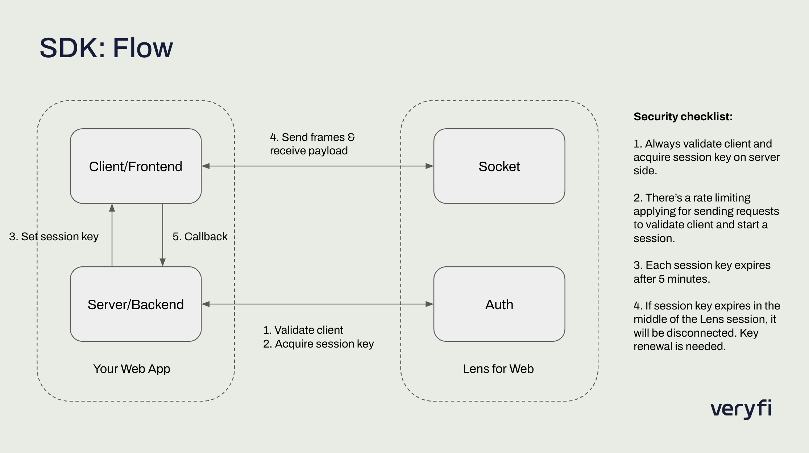

[](https://opensource.org/licenses/MIT)

# Veryfi Lens for Web SDK Demo

Veryfi Lens for Web SDK is a framework for your web app to give it document capture superpowers in minutes.

This project is a demo to showcase how you can integrate Lens into your web app. It follows a client-server architecture where the server is for validating your client and getting session key and the client side is for displaying and showing Lens components for capturing documents.



The server side is a simple Node.js's Express server. To get started, first make sure you have a valid credentials in `server.js`:

```
const CLIENT_ID = "YOUR_CLIENT_ID_HERE"; // make sure to keep them as a secret
const CLIENT_SECRET = "YOUR_CLIENT_SECRET_HERE";
const API_KEY = "YOUR_API_KEY";
const USERNAME = "YOUR_USERNAME";
```

Install dependencies:
```
npm install
```

To start the backend server on port 5001:
```
npm start
```

To start the front-end server on port 8080:
```
npm src/http-server.js
```

To change classes run:
```
npx tailwindcss -i ./src/input.css -o ./src/output.css --watch  
```
